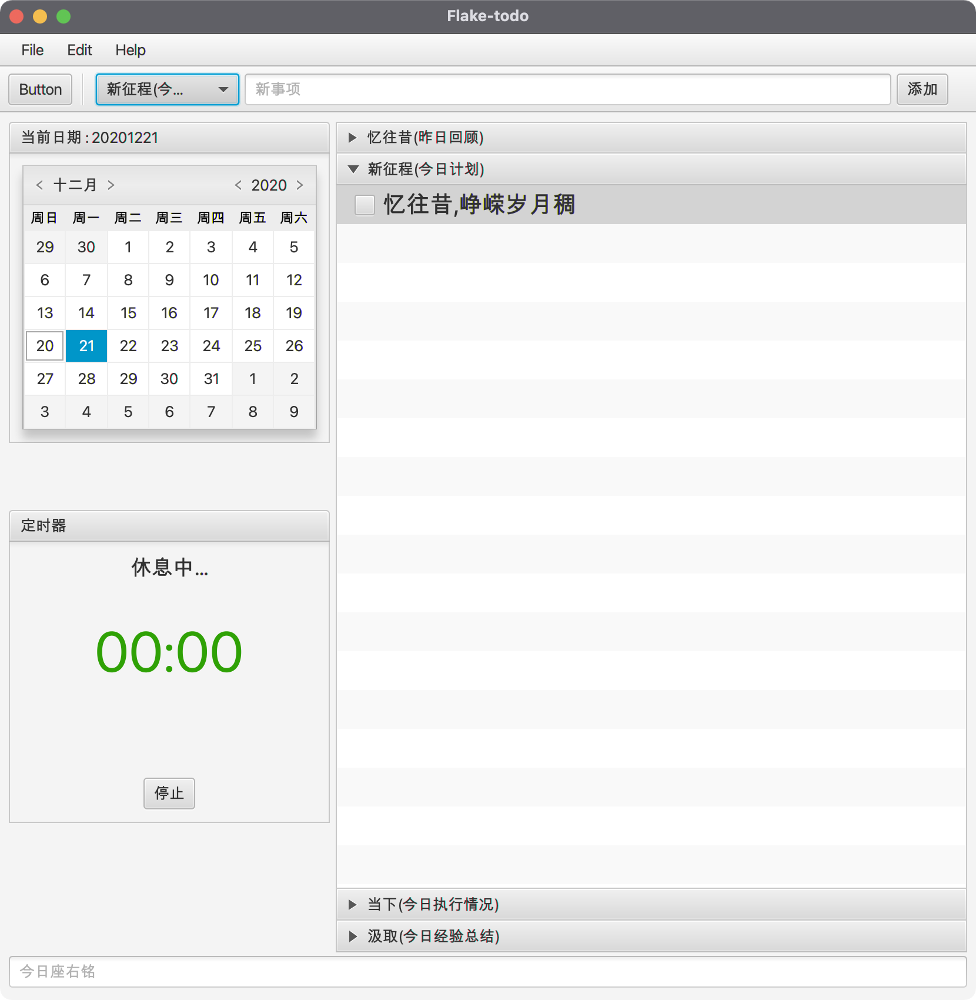

# flake-todo

TODO - app build by JavaFX

- JavaFX 13
- Spring boot 2.2
- MyBatis 3.5.6
- MyBatis-plus 3.4.1
- Sqlite 3

## project todo

- [x] global focus and nap notify
- [x] undone list
- [x] task edit
- [x] logic delete
- [x] sort by priority
- [ ] db check after launch
- [x] context menu of LiveView rebuild